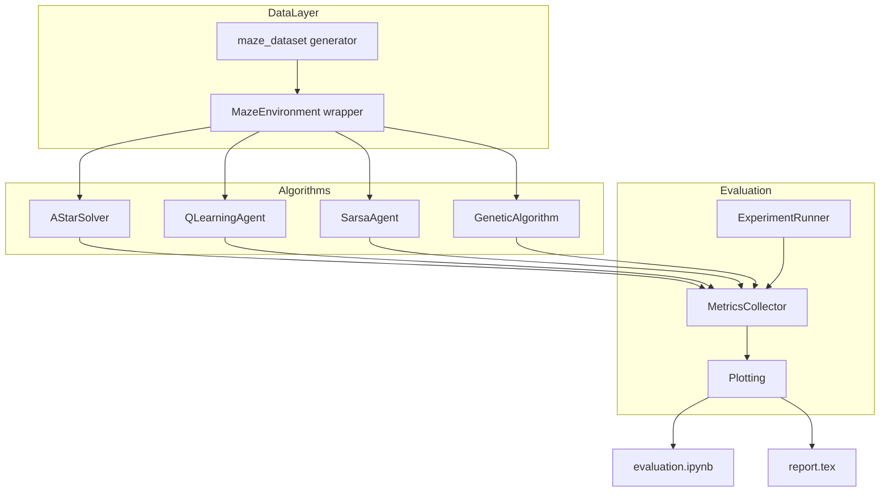

# Porównanie algorytmów nawigacji w labiryncie

Specyfikacja projektu kursowego: implementacja, ewaluacja i porównanie algorytmów nawigacji w labiryncie (A*, Q-Learning, SARSA, algorytm genetyczny).

---

## 1. Informacje ogólne

| Element | Wartość |
| :--- | :--- |
| **Kontekst** | Projekt na zajęcia (kurs) |
| **Język programowania** | Python |
| **Główne pakiety** | `numpy`, `maze-dataset`, `matplotlib`, `jupyter`, `joblib` (równoleglenie eksperymentów) |
| **Założenie architektoniczne** | Własnoręczna implementacja algorytmów z minimalnym wykorzystaniem wysokopoziomowych bibliotek ML |
| **Język kodu** | Angielski (nazwy modułów, komentarze) |
| **Język raportu** | Polski (LaTeX) |

### Deliverables

- Pakiet Python: `src/maze_solvers/`
- Notebook ewaluacyjny: `notebooks/evaluation.ipynb`
- Raport : `report/report.tex` (+ `report/figures/`)

### Poza zakresem

- Deep RL
- Jedna wspólna polityka uczenia na wielu labiryntach jednocześnie
- Zaawansowane biblioteki ML poza `numpy` i `maze-dataset`

---

## 2. Cel projektu

Głównym celem jest zbadanie, implementacja oraz porównanie skuteczności różnorodnych podejść algorytmicznych do nawigacji agenta w labiryncie. Projekt obejmuje:

- klasyczne przeszukiwanie grafów (A*),
- uczenie ze wzmocnieniem w wersji tabelarycznej (Q-Learning, SARSA),
- algorytm genetyczny.

Szczególny nacisk:

- analiza zbieżności RL w wariantach *on-policy* (SARSA) vs *off-policy* (Q-Learning),
- porównanie **action masking** vs brak maskingu w RL (4 warianty RL),
- porównanie wszystkich metod w tym samym środowisku testowym.

**Dla kogo:** ocena kursowa — działający kod, wykresy, raport w standardowej strukturze akademickiej.

---

## 3. Podsumowanie wymagań (potwierdzone)

- **Co:** 6 wariantów rozwiązań w jednym środowisku: A*, Q-Learning, Q-Learning + mask, SARSA, SARSA + mask, GA.
- **Labirynty:** sweep rozmiarów **5×5, 10×10, 20×20**; **3 seedy** na rozmiar (np. 0, 1, 2).
- **RL:** tabular Q-table; osobny trening **per labirynt**; epsilon-greedy.
- **Nagrody RL/GA:** duży bonus za cel, mała kara za krok, większa kara za ścianę, kara za ponowną wizytę stanu.
- **GA:** chromosom o **zmiennej długości**; nielegalne ruchy dozwolone, karane w fitness (agent stoi w miejscu).
- **Powtórzenia:** 3 runy treningu per (labirynt, algorytm RL/GA) — średnia i odchylenie na wykresach.

---

## 4. Założenia domyślne

| Obszar | Założenie |
| :--- | :--- |
| Start / cel | Domyślne z `maze-dataset`; ten sam seed = ten sam layout |
| Seedy labiryntu | 3 na każdy rozmiar |
| Trening RL | Osobno per labirynt; ta sama liczba epizodów dla wszystkich wariantów RL |
| Eksploracja | ε-greedy: start ε=1.0 → decay do ε_min; wspólne hiperparametry Q-Learning i SARSA |
| Limit kroków | `max_steps = k × długość_opt_A*` (np. k=3) — Success Rate, RL, GA |
| GA | Populacja ~50–100; generacje skalowane rozmiarem (np. 100 / 200 / 300); selekcja turniejowa, krzyżowanie jednopunktowe, mutacja |
| Powtarzalność | `numpy.random.default_rng(seed)` wszędzie |

### Otwarte detale (ustalane w notebooku)

- Dokładna liczba epizodów RL i generacji GA (np. 500 / 1000 / 2000 — tak, by krzywe na 20×20 były czytelne w rozsądnym czasie)
- Współczynnik `max_steps` względem optymalnej ścieżki A*
- Konkretne wartości α, γ, ε-decay

---

## 5. Zestawienie algorytmów

### 5.1. Algorytm referencyjny (baseline)

**A* (A-star)**

- Graf 4-kierunkowy z gridu `maze-dataset`
- Heurystyka Manhattan
- Zawsze optymalna (najkrótsza) ścieżka — *ground truth*
- Zwraca: ścieżkę, długość, czas wykonania

### 5.2. Uczenie ze wzmocnieniem (tabular RL)

Macierz Q o wymiarach `(n_states, 4)`; przy **action masking** wybór akcji (ε-greedy) tylko z legalnych ruchów; update Q na faktycznie wykonanej akcji.

| Wariant | Typ | Opis |
| :--- | :--- | :--- |
| **Q-Learning** | Off-policy | Uczy się na max Q w następnym stanie; wariant bez maskingu i z maskingiem |
| **SARSA** | On-policy | Uczy się na akcji faktycznie wykonywanej (z eksploracją); wariant bez maskingu i z maskingiem |

**Bez action masking:** pełna przestrzeń 4 akcji; trafienie w ścianę = brak ruchu + kara.

**Z action masking:** wybór tylko z `legal_actions(state)`.

Wspólny interfejs treningu: `train(env, episodes, **hyperparams) -> TrainingResult` (historia nagród, kroków do celu, polityka greedy do ewaluacji).

### 5.3. Algorytm genetyczny (GA)

- **Osobnik:** lista kierunków o **zmiennej długości** (`list[Direction]`)
- **Inicjalizacja:** losowa sekwencja; `max_len` np. ~4× długość optymalnej ścieżki A*
- **Fitness:** bonus za dotarcie do celu + suma kar (krok, ściana, rewizyta) — wagi wspólne z RL (`rewards.py`)
- **Nielegalne ruchy:** dozwolone w chromosomie; agent stoi w miejscu; fitness obniżone
- **Operatory:** selekcja turniejowa, krzyżowanie jednopunktowe, mutacja (zmiana / wstawienie / usunięcie kroku)
- **Elitizm:** top 1–2 osobników bez zmian

---

## 6. Reprezentacja środowiska

Biblioteka `maze-dataset` — struktury map w formie gridu.

| Element | Opis |
| :--- | :--- |
| **Przestrzeń akcji** | 4 dyskretne akcje: Góra, Dół, Lewo, Prawo |
| **Przestrzeń stanów (RL)** | Współrzędne `(x, y)` lub flat index |
| **Ściana** | Brak ruchu + kara (`hit_wall` w `info`) |
| **Rewizyta** | Kara za ponowne odwiedzenie `(x, y)` w epizodzie (`revisited` w `info`) |

### Interfejs `MazeEnvironment` (`maze_env.py`)

- `reset() -> state`
- `step(action) -> (next_state, reward, done, info)` — `info`: `hit_wall`, `revisited`
- `legal_actions(state) -> list[Action]` — dla action masking
- `simulate_path(actions) -> PathResult` — dla GA i walidacji ścieżki RL

### Funkcja nagród (`rewards.py`)

Wspólne wagi dla RL i fitness GA (wartości startowe, tunable w notebooku):

| Symbol | Wartość | Znaczenie |
| :--- | :--- | :--- |
| `R_goal` | +100 | Duży bonus za dotarcie do celu |
| `R_step` | -1 | Mała kara za każdy krok |
| `R_wall` | -5 | Większa kara za trafienie w ścianę |
| `R_revisit` | -2 | Kara za ponowną wizytę komórki w epizodzie |

Tablica `visited` resetowana co epizod / przy symulacji ścieżki GA.

---

## 7. Metryki ewaluacyjne

| Metryka | Opis |
| :--- | :--- |
| **Success Rate** | % runów, w których agent dotarł do celu w limicie `max_steps` |
| **Path Optimality** | `len(ścieżka) / len(A*)` (wartość ≥ 1.0) |
| **Krzywa zbieżności** | Średnia suma nagród (RL) lub najlepszy fitness (GA) vs epizod / generacja |
| **Czas wykonania** | Wall-clock treningu lub znalezienia rozwiązania |

### Macierz eksperymentów

| Wymiar | Wartości |
| :--- | :--- |
| Rozmiar labiryntu | 5×5, 10×10, 20×20 |
| Seed labiryntu | 3 |
| Algorytm | A*, Q-Learning, Q-Learning+mask, SARSA, SARSA+mask, GA |
| Run treningu (RL/GA) | 3 |

### Artefakty z notebooka

- Wykresy zbieżności per rozmiar
- Tabele metryk końcowych (CSV → raport LaTeX)
- Przykładowe wizualizacje ścieżek (jeden labirynt, wszystkie algorytmy)

---

## 8. Równoleglenie eksperymentów (`joblib`)

Do wykorzystania wielu rdzeni CPU przy **niezależnych** uruchomieniach (osobny trening / ewaluacja per konfiguracja). Nie równoleglimy pojedynczego epizodu RL ani pojedynczej aktualizacji Q — te są sekwencyjne.

### Co równoleglić

1. **Główny sweep** w `experiment.py` — każda kombinacja `(rozmiar, seed_labiryntu, algorytm, run_id)` to osobny job:
   - trening Q-Learning / SARSA (cały przebieg epizodów w jednym procesie),
   - uruchomienie GA (cała ewolucja w jednym procesie),
   - A* per labirynt (szybkie, opcjonalnie w tym samym poolu dla spójności kodu).

2. **Opcjonalnie w GA** — ewaluacja fitness całej populacji w jednej generacji (`Parallel` po osobnikach), jeśli populacja jest duża a pojedynczy labirynt wolny.

### Wzorzec w `experiment.py`

```python
from joblib import Parallel, delayed

def run_single_experiment(config: ExperimentConfig) -> ExperimentResult:
    rng = np.random.default_rng(config.seed)
    env = build_env(config)
    # train or solve; return metrics + convergence curve
    ...

results = Parallel(n_jobs=-1, verbose=10)(
    delayed(run_single_experiment)(cfg) for cfg in all_configs
)
```

- `n_jobs=-1` — wszystkie dostępne rdzenie; w notebooku można ustawić np. `n_jobs=4` przy debugowaniu.
- Funkcja top-level (`run_single_experiment`) + **konfiguracja przez prosty dataclass/słownik** — wymagane do picklingu w procesach potomnych.
- **Osobny seed RNG w każdym jobie** (`config.seed`) — powtarzalność wyników niezależnie od kolejności i liczby workerów.

### Czego nie robić

- Współdzielona jedna Q-table między procesami (brak sensu, tabular RL jest sekwencyjny).
- Równoleglenie epizodów wewnątrz jednego treningu bez architektury actor-learner (niepotrzebna złożoność).
- Duże obiekty w closure `delayed` — przekazuj tylko `ExperimentConfig`, buduj `env` w workerze.

### Wpływ na czas

Przy macierzy ~6 algorytmów × 3 rozmiary × 3 seedy × 3 runy ≈ **162 joby** treningowe (plus A*) — `joblib` skraca wall-clock zbliżenie do `T_sekwencyjny / n_rdzeni` (z narzutem startu procesów), co jest istotne przy 20×20 i wielu epizodach.

---

## 9. Architektura



### Struktura repozytorium

```
mpum-mazesolvers/
├── README.md
├── pyproject.toml
├── src/
│   └── maze_solvers/
│       ├── __init__.py
│       ├── maze_env.py       # wrapper maze-dataset
│       ├── astar.py
│       ├── q_learning.py
│       ├── sarsa.py
│       ├── genetic.py
│       ├── rewards.py        # wspólne wagi nagród/kar
│       ├── metrics.py
│       └── experiment.py     # orchestracja sweepu
├── notebooks/
│   └── evaluation.ipynb
├── report/
│   ├── report.tex
│   ├── figures/
│   └── references.bib        # opcjonalnie
├── results/                  # CSV/JSON (opcjonalnie w .gitignore)
└── tests/
```

---

## 10. Raport LaTeX (`report/report.tex`)

Struktura standardowa (język polski):

1. **Wstęp** — cel, hipotezy (np. SARSA ostrożniejsze od Q-Learning; masking poprawia efektywność próbkowania)
2. **Metoda** — środowisko, nagrody, algorytmy, hiperparametry, macierz eksperymentów
3. **Eksperymenty** — sweep rozmiarów, seedy, metryki
4. **Wyniki** — wykresy z `figures/`, tabele success / optimality / time
5. **Wnioski** — on-policy vs off-policy, wpływ maskingu, ograniczenia GA vs RL

---

## 11. Dziennik decyzji

| Decyzja | Rozważane alternatywy | Uzasadnienie |
| :--- | :--- | :--- |
| Pakiet `src/` | płaska struktura / minimal | Czytelność, testy, reużycie w notebooku |
| Sweep 5/10/20 + 3 seedy | 1 labirynt / 10+ seedów | Balans czas vs wiarygodność wyników |
| 4 warianty RL (Q/SARSA × mask) | tylko bez maskingu | Główny wątek raportu o legalnych akcjach |
| GA: zmienna długość chromosomu | stała długość | Krótsze ścieżki na małych mapach |
| GA: kara za nielegalne ruchy | repair / mask w mutacji | Spójność z RL bez maskingu; prostsza implementacja |
| A* jako ground truth | Dijkstra | Optymalność z heurystyką Manhattan |
| Notebook → PNG/CSV do raportu | tylko wykresy inline | Łatwa integracja z LaTeX |
| Równoleglenie: `joblib` | stdlib `ProcessPoolExecutor`, `ray`, `dask` | Proste API pod sweep; lekka zależność; wystarczy na jednej maszynie |

---

## 12. Ryzyka i mitigacje

| Ryzyko | Mitygacja |
| :--- | :--- |
| Tabular RL wolne na 20×20 | Umiarkowana liczba epizodów; progress bar w notebooku |
| GA nie zbiega na dużych mapach | `max_len` od A*; elitism; więcej generacji dla 20×20 |
| Niespójne nagrody GA vs RL | Wspólny moduł `rewards.py` |
| Zmiana API `maze-dataset` | Pin wersji w `pyproject.toml`; cienki wrapper w `maze_env.py` |
| Narzut `joblib` / pickling | Top-level worker + lekki `ExperimentConfig`; `n_jobs` mniejsze przy debugu |

---

## 13. Kolejność implementacji

1. Środowisko (`maze_env.py`) + A* (`astar.py`) — ground truth
2. Moduł nagród (`rewards.py`) + testy środowiska
3. Q-Learning i SARSA — najpierw bez maskingu, potem `use_action_mask`
4. Algorytm genetyczny (`genetic.py`) ze wspólnym symulatorem ścieżki
5. `experiment.py` + `metrics.py` + równoległy sweep (`joblib`) + eksport CSV
6. Notebook `evaluation.ipynb` — wykresy i eksport do `report/figures/`
7. Szkielet `report/report.tex`

